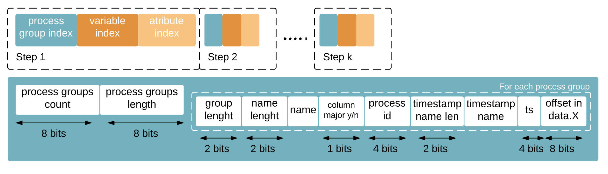
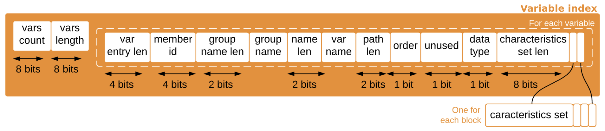

# ADIOS Workflow for the BP4 Engine

Steps from initialization to performing I/O operations, description of the buffers needed and the format of the headers.
The BP4 engine is a file engine and uses POSIX functions underneath.

TODO, move sections to different files
<a href="#Buffer Headers" /> Buffer Headers </a> <br/>
<a href="#Debugging ADIOS" /> Debugging ADIOS </a>

## Workflow

### Write

There are three sections in the write workflow: initialization (executed during the IO.Open call), performing puts (executed during the simualtion) and close (executed during IO.Close call).

**Initialization**

```
- Serializer constructor in toolkit/format/bp/bp4
- BP4Writer constructor in engine/bp4
- BP4Writer::Init
- BP4Writer::InitParameters
- BP4Writer::InitTransports
- BP4Writer::InitBPBuffer
- BP4Serializer::MakeHeader
- BP4Serializer::PutProcessGroupIndex
```

The application create an IO object and calls Open.
```c++
adios2::Engine bpWriter = io.Open(fname, adios2::Mode::Write);
```

The `Open` function, initializes a Serializer object and a BP4Writer object and initializes all the buffers and objects needed for writing data into a file.
  - BP4Writer::InitParameters 
      - Initalizes input parameters passed through the `adios2::IO` variable (e.g. `io.SetEngine('BP4')`)

  - BP4Writer::InitTransports 
      - Transport is set by default to `File`. The function creates the files it will use to write the data (If burst buffers are used the file names contain the path to the BB)
      - In case there is aggregation (not all ranks write files) the `m_BP4Serializer.m_Aggregator.m_IsConsumer` decides which ranks are in charge of writing
      - The BP folder is created and inside the data.rank files are created
```
m_FileDataManager.OpenFiles(m_SubStreamNames, m_OpenMode,
                            m_IO.m_TransportsParameters,
                            m_BP4Serializer.m_Profiler.m_IsActive);
```
  -
      - Rank 0 creates the metadata files (`{name}.md.0` and `{name}.md.idx`)

  - BP4Writer::InitBPBuffer
      - Prepares the buffer headers
      - BP4 supports an Append mode where a simulation can be restarted from a given step (all the data that was written previously will be loaded before continuing the execution)
      - If the mode is not Append and the files are all new, the function makes the header for the data, matadata and the metadata index file by calling `MakeHeader`.

The `MakeHeader` function:
- Called by the data, metadata and the index metadata files
- Adds ADIOS and BP version to the header 
- Adds information about the format of the data (little endian .. )
- Adds the first `ProcessGroup` block in the data file following the format of the header described in the next section

```
    m_BP4Serializer.PutProcessGroupIndex(
        m_IO.m_Name, m_IO.m_HostLanguage,
        m_FileDataManager.GetTransportsTypes());

```

**Writing data to the bp4 files**
```
- BP4Writer::BeginStep
- BP4Writer::DoPut
- BP4Writer::CurrentStep
- BP4Writer::EndStep
- BP4Writer::PerformPuts
```

The applications calls Put for any number of variables between calls to BeginStep and EndStep. There are two modes of writing data: deferred and sync. `Put` only copies variables to ADIOS buffers but does not write them until PerformPuts is executed. In sync mode data is copied to an ADIOS buffer at every put, in deferred mode, pointers to the data are being saved at every put and the data copied durint the `PerformPuts` function. 

The `BeginStep` function clears all the deferred variables.

The two different types of Write and differentiate by different Put functions in the `BP4Writter.cpp` file:
```
#define declare_type(T)                                                        \
    void BP4Writer::DoPutSync(Variable<T> &variable, const T *data)            \
    {                                                                          \
        PutSyncCommon(variable, variable.SetBlockInfo(data, CurrentStep()));   \
        variable.m_BlocksInfo.pop_back();                                      \
    }                                                                          \
    void BP4Writer::DoPutDeferred(Variable<T> &variable, const T *data)        \
    {                                                                          \
        PutDeferredCommon(variable, data);                                     \
    }
```
During Put, the current step is recorded.

The `EndStep` function perform puts if there are any deferred variables that have not been copied, serializes the data and flushes.
Flushing the data is done at certain steps (`currentStep % flushStepsCount == `) and it includes serializing the data,
write data or write the aggregate data to the `.data` files, reseting the buffer and write the metadata in both files (`md.0` and `md.idx`).
At the end the current step is advanced.

```
- BP4Writer::Flush 
- BP4Writer::DoFlush
- BP4Writer::AggregateWriteData
- BP4Serializer::CloseStream
- BP4Serializer::SerializeMetadataInData
- BP4Writer::WriteCollectiveMetadataFile
```

The `WriteCollectiveMetadataFile` function aggregates information from all the writing ranks into one metadata file by calling
`BP4Serializer::AggregateCollectiveMetadata` and `AggregateCollectiveMetadataIndices`.
The aggregated metadata is afterwards written by the `WriteFiles` function defined in `toolkit/transportman/TransportMan.cpp`:
```
        m_FileMetadataManager.WriteFiles(
            m_BP4Serializer.m_Metadata.m_Buffer.data(),
            m_BP4Serializer.m_Metadata.m_Position);
```

At the end, `BP4Writer::PopulateMetadataIndexFileContent` adds information about the current step in the metadata index buffer.
All the buffers storing data and metadata are reset for the next step.

All functions responsible with writing data or metadata to bp files call the `Write` function inside the corresponding transport class. For the BP4 engine, the transport is `file` implemented in `/source/adios2/toolkit/transport/file/FilePOSIX.*`.

**Closing the files**

The application calls `IO.Close()` after the simulation is done. The routine in the end, writes out the deferred data and metadata in case EndStep or PerformPuts were not called, writing the index metadata file, close the data, metadata and the metadata index files and erase the engine object from IO.

## Buffer Headers

BP4 File structure:
- `outpub.bp` folder containing:
  - `md.idx`: table with 64 byte long rows indexing the metadata file
  - `md.0`: file with metadata information for all variables (`global.md` in BP3)
  - `data.0`, `data.aggregation_step`, ..., `data.N`: data files, incorporating metadata interspersed with the data object

The metadata file contains data for the process group (which is written for every ADIOS step), the variable and attribute index. The variables holding this data until they are written to disk are located in `format/bp/BPBase.h`:

```
    /** contains data buffer for this rank */
    BufferSTL m_Data;

    /** contains collective metadata buffer, only used by rank 0 */
    BufferSTL m_Metadata;

    /** contains metadata indices */
    MetadataSet m_MetadataSet;
```



Every time data is moved from the user buffer to the ADIOS buffer (in `Sync` mode every time there is a `Put`; in `Deferred` mode during `PerformPuts` or at the end of the step).
```c++
m_BP4Serializer.PutVariableMetadata(variable, blockInfo, sourceRowMajor);
m_BP4Serializer.PutVariablePayload(variable, blockInfo, sourceRowMajor);
```
The `PutVariablePayload` function calls `PutPayloadInBuffer` and copies the user data to adios buffers. 
The `PutVariableMetadata` function calls `PutVariableMetadataInIndex` which writes the info related to the variable index in the metadata file. The information is given in the following figure:



The characteristics set represents tuples of (metric, value) writen by the `PutVariableCharacteristics` function. One such tuple is the payload offset (where the data starts inside the ADIOS buffer). This value is set in the `BP4Serializer.cpp` file:

```c++
line 39:       auto lf_SetOffset = [&](uint64_t &offset) {
                       offset = static_cast<uint64_t>(m_Data.m_Position);

line 67:       lf_SetOffset(stats.PayloadOffset);

line 734:      PutCharacteristicRecord(characteristic_payload_offset,
                            characteristicsCounter, stats.PayloadOffset,
                            buffer);
```

Variable x written in a given step is stored in storage in file `data.{rank_id}` starting with offset `{offset_position}` where `offset_position` is the offset in the variable index added with the offset in the process group index; `rank_id` is stored in the process group index. All the additional information needed is set in file `BP4Serializer.cpp`:

```
line 181:      const uint32_t processID = static_cast<uint32_t>(m_RankMPI);
               helper::InsertToBuffer(metadataBuffer, &processID);
line 196:      helper::InsertU64(metadataBuffer, m_Data.m_AbsolutePosition + m_PreDataFileLength);
```

## Debugging ADIOS

Build ADIOS with the `-DCMAKE_BUILD_TYPE=DEBUG` flag.<br/>
Using VSCode to debug ADIOS, the following `launch.json file` uses llbd to go through the code:
```json
    "version": "0.2.0",
    "configurations": [
        {
            "name": "(lldb) Launch",
            "type": "cppdbg",
            "request": "launch",
            "program": "${workspaceFolder}/build/bin/bpCamWriteRead",
            "args": [],
            "stopAtEntry": false,
            "cwd": "${workspaceFolder}",
            "environment": [],
            "externalConsole": false,
            "MIMode": "lldb"
        }
    ]
}
```

If the process hangs during debugging or even if it successfully ends, there migh still be danggling processes in the background. 
In order to run another lldb process, these need to be killed: `ps aux | grep lldb` and `kill {pid}`.

