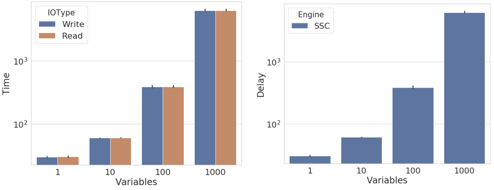

# Running the codes

## Compie the codes

### Summit

The root folder for the experiments using the base engine codes can be found in:
`/gpfs/alpine/csc143/proj-shared/againaru/adios/engine_perf`.

To compile all the codes and create executables for each engine, load all the necessary packages:
```bash
module load cmake
module load gcc
```

Build the codes:
```bash
mkdir build
cd build
cmake -D adios2_ROOT=/ccs/home/againaru/adios/ADIOS2-init/install/lib64/cmake ..
make -j4
```

To run the code, due to incomptibility between libfabrics and mpi.
```
export LD_PRELOAD=/usr/lib64/libibverbs.so.1:/usr/lib64/librdmacm.so.1
```

The codes have been tested with the following versions:
```
cmake version 3.18.2
gcc (GCC) 6.4.0
```

Each node on Summit contains two IBM POWER9 processors and six NVIDIA Tesla V100 accelerators.
One CPU processor contains 12 double precision cores.

### Personal system
```bash
cmake -D adios2_ROOT=~/work/adios/ADIOS2-init/install/lib/cmake ..
make -j4
```

## Simulation scenarios

1. Figure showing how increasing the total exchanged data does not correspond with an increase in execution time / throughput.
2. Figure showing performance as we increase the number of writers / readers
    - Number of writers (`WR = 32, 64, 128, 256, 512, 1024`) and readers `RD = WR / 2`
    - Strong scaling by keeping the same amount of total data (D) and data per writer (D/WR), per reader (D/RD) 
    - Weak scaling by keeping the data per writer fixed, total amount of data increases with WR 
3. Impact of different variables by keeping the total data exchanged constant
    - Impact of number of variables storing the total data (same WR, RD, variables and array size per variable change)
    - Impact of the array dimensions (1D, 2D array)
    - Impact of number of writers putting the total data (same V, RD, writers and array size per writer change)
    - Impact of number of readers getting the total data (same V, WR, readers and array size per reader change)
4. Inline performance

**Notations:**
- `WR` writers, `RD` readers, `V` variables, `N` array size
- Each writer puts `V * N` floats into the stream and each reader gets `V * N * WR / RD` floats in each run.
- Total amount of data exchanged through the system `D = WR * V * N`

### 1. Variable impact

Same number of writers `WR`, same number of readers `RD` and constant total amount of data streaming between them.

- Each scenario uses different number of variables and array sizes so that `V * N` is constant 
- `V = 1; N = 1GB`; `V = 10; N = 100MB`; `V = 100; N = 10MB`; `V = 1000; N = 1MB`

**SSC**



### 2. Same total write size

In this scenario we keep the same number of writers `WR` and readers `RD` and increase the amount of data that is streamed.
 - one 1D variable is being used in a one step simulation -

Each writer puts `N` floats into the stream and each reader gets `N * WR / RD` floats in each run.

Data is gathered for:
- `WR = 100` and `RD = 10` 
- `WR = 10` and `RD = 1`
- The file size increases from 100MB to 4GB per writer `N = { 100...4096 }`.

### 3. Same total read size


## Running each engine

**SST, SSC, Inline**

On the **Writer side**, each rank writes V variables each of  N floats of random values.
On the **Reader side**, each rank reads an equal portion of the written data. Parameters that can be changed are number of ranks for read/write and total array size.

Test caes include:
- Equal number of readers and writers (1, 10, 100, 1000 processors) exchanging 100MB/rank or 4GB/rank data.
- Increasing the number of variables 1, 10 , 100
- Increasing the number of writers to one reader (total write size kept the same)
- One writer and increase number of readers (total read size per rank kept the same)

The repo contains batch script used to submit on Summit.


**DataMan**
```bash
./dmWriter & ./dmReader
libc++abi.dylib: terminating with uncaught exception of type std::invalid_argument: ERROR: this version didn't compile with DataMan library, can't use DataMan engine
```

**DataSpaces**
```bash
./dsWriter & ./dsReader
Invalid argument exception, STOPPING PROGRAM from rank 0
ERROR: this version didn't compile with DataSpaces library, can't use DataSpaces engine
```
