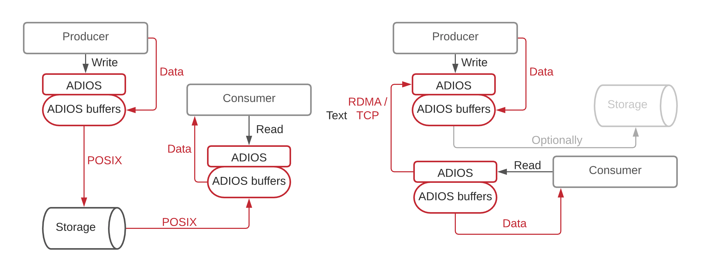
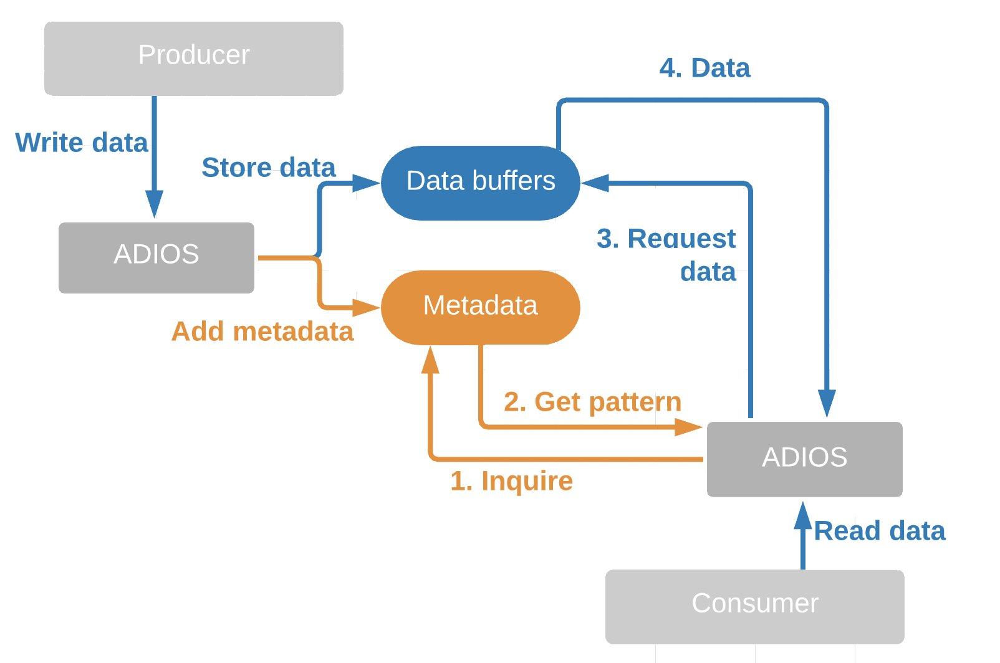

# SST/SSC engines

Engines for providing concurrent access to data to one or more consumers through memory or streamed over the network.

Streaing engines provide the application an API so that the data producer can mark data as generated which will make it available to be read by the consumers using the provided API in ADIOS. Each staging engine has the ability to move the data in different ways.

For file engines the consumer can be the same as the producer or multiple other applications running on the same network, data center or running remotely on a differnt site. The write/read operations are going through the ADIOS API which are translated underneath to POSIX calls to a storage. 

## SST

The SST engine uses RDMA, TCP,  UDP, or shared memory to move data from a producer (one parallel application) to consumers (one or multiple independent parallel applications).

Generated data is  stored in an internal ADIOS buffer in the producer’s memory. Con-sumers can then pull data from this buffer using the ADIOS API.

The  SST engine  aggregates  metadata  for  every  step  that  generates data  and  shares  it  with  all  the  consumers  that  register  for it. The SST engine implements a request-response protocol in  which  the  consumer  inquires  the  metadata,  does  the selection of what parts it need and then submits the request for data

## SSC

Optimized for MPI applications with constant data geometry (metadata does not change over time). It uses one sided MPI communication and executes steps 1 and 2 only once.
Once  the  metadata  has been  published  and  the  consumers  receives  the  geometry pattern it will not update it until the end of the application.

Push model where data is sent to the consumer at  every  IO  step. 

## DataMan

The DataMan algorithm is designed for interactions between few producers and consumers over wide area network.

The metadata and data are sent together to all the consumers. Consumers have no information about the producers, they just wait for data to be pushed into their buffers.

Unlike SST, steps 1 and 3 are eliminated and steps 2 and 4 are combined into one.
