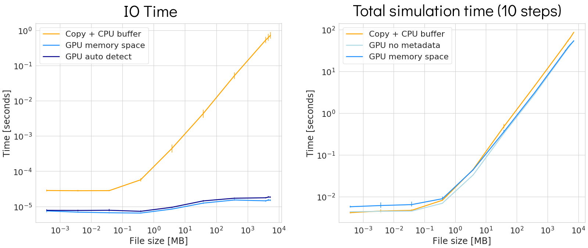

# GDS Performance

Measuring the performance of accessing a buffer stored on GPU space to the storage.

Performance is measured by a simple benchmark, that loops over a fixed number of steps and calls ADIOS Put on every step. The benchmark is in the benchmark.cuda folder and follows the following pseudocode:

```c++
1:  // for automatic detection
2:  data.SetMemorySpace(adios2::MemorySpace::Detect);
3:
4:  for(int i=0; i<nsteps; i++){
5:    bpWriter.BeginStep();
6:    if (GPUbuffer){
7:       // when we don't want to use automatic detection
8:       data.SetMemorySpace(adios2::MemorySpace::CUDA);
9:       bpWriter.Put(data, gpuSimData);
10:   }
11:   else{
12:      cudaMemcpy(cpuSimData, gpuSimData, ..);
13:      // when we don't want to use automatic detection
14:      data.SetMemorySpace(adios2::MemorySpace::Host);
15:      bpWriter.Put(data, cpuSimData);
16:    }
17:    bpWriter.EndStep();
18:  }
```

The simulation time measures the execution between lines 1 and 18. The IO time for GPU measures the execution between lines 6 and 10, and for CPU between lines 13 and 16. The copy time measures the execution of the cudaMemcpy function (line 12).

## GPU Aware 

- Measure performance when using CPU buffers compared to the initial ADIOS version.
- Measure using GPU buffers compared to CPU buffers
- Performance using GPU buffers with no metadata, with the memory space provided, with automatic detection

Fig 1. Write performance for GPU Aware ADIOS


## GDS

Measure the performance of writing an array of N floats residing on GPU memory space, written all at once.
1. GDS POSIX: Use Nvidia's GDS
2. CPUCopy POSIX: Copy the data from GPU to CPU memory space and use POSIX write
3. GDS ADIOS: Send the GPU buffer to ADIOS
4. CPU ADIOS: Send the CPU buffer to ADIOS

Fig 1. Write total simulation performance for GDS ADIOS

