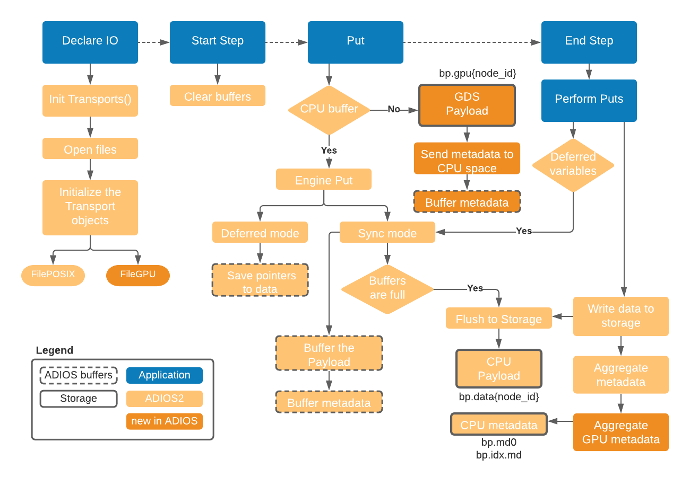

# Changes to the ADIOS2 library 

Changes to the ADIOS library follow the diagram below



In order to allow the application code to call `adios2::IO::Put` using GPU buffers, the ADIOS library requires several new classes and changes to the cmake files.

## Code changes

List of files that require changes in ADIOS:
1. New transport for GPUDirect
```
    source/adios2/toolkit/transport/gpu/GPUdirect.cpp
    source/adios2/toolkit/transport/gpu/GPUdirect.h
```
2. Utility functions for the new transport
```
    source/adios2/toolkit/format/bp/BPBase.cpp
    source/adios2/toolkit/format/bp/BPBase.h
    source/adios2/toolkit/format/bp/bp4/BP4Base.cpp
    source/adios2/toolkit/format/bp/bp4/BP4Base.h
```
3. Changes in the File Engine
```
    source/adios2/engine/bp4/BP4Writer.cpp
    source/adios2/engine/bp4/BP4Writer.h
```
4. Compiling
```
   examples/CMakeLists.txt
   source/adios2/CMakeLists.txt
```

Each bullet is described bellow.

### 1. Create a new transport for GPU direct

The transport is implemented in the `GPUdirect.*` files from `source/adios2/toolkit/transport/gpu/`.
The files are also uploaded in this repo in `adios/transport`.

### 2. Utility functions for the new transport

**Functions for returning the name of the bp gpu files**

Changes inside `ADIOS2/source/adios2/toolkit/format/bp/bp4/BP4Base.*`.

```c++
std::vector<std::string>
BP4Base::GetBPGPUFileNames(const std::vector<std::string> &names) const
    noexcept
{
    std::vector<std::string> gpuFileNames;
    gpuFileNames.reserve(names.size());
    for (const auto &name : names)
    {
        gpuFileNames.push_back(GetBPGPUFileName(name, m_RankMPI, m_RankGPU));
    }
    return gpuFileNames;
}

std::string BP4Base::GetBPGPUFileName(const std::string &name,
    const size_t indexMPI, const size_t indexGPU) const
    noexcept
{
    const std::string bpName = helper::RemoveTrailingSlash(name);
    const std::string bpGPUDataRankName(bpName + PathSeparator + "gpu." +
                                         std::to_string(indexMPI) + "." +
                                         std::to_string(indexGPU));
    return bpGPUDataRankName;
}
```

Files written through GPU direct will be stored in `<base_name.bp>/gpu.<MPI rank>.<GPU id>`.

**Store the GPU id in a variable**

The `m_RankGPU` will be added in `source/adios2/toolkit/format/bp/BPBase.*`.

```c++
    #ifdef ADIOS2_HAVE_CUDA
        cudaGetDevice(&m_RankGPU);
    #endif
```

### 3. Changes in the File Engine

## 4. Compiling

**Compile ADIOS with Cuda enabled**

Add the Cuda compiler checks in `CMakeList.txt` and `DetectOptions.cmake`
- Add an option to have Cuda `adios_option(CUDA "Enable support for Cuda" AUTO)`
- Add Cuda when setting the Config options in `ADIOS2_CONFIG_OPTS`
- Print information about the Cuda compiler

```
if(ADIOS2_HAVE_CUDA)
       message("  Cuda Compiler : ${CMAKE_CUDA_COMPILER} ")
endif()
```

If the Cuda compiler is found, find the cmake package for it in `cmake/DetectOptions.cmake`
```
if(ADIOS2_USE_CUDA STREQUAL AUTO)
  find_package(CUDA)
elseif(ADIOS2_USE_CUDA)
  find_package(CUDA REQUIRED)
endif()
if(CUDA_FOUND)
  set(ADIOS2_HAVE_CUDA TRUE)
endif()
```

**Check for GPU buffers inside ADIOS**

If Cuda is enabled, the ADIOS library will check if the buffer provided by the user is in GPU or CPU space. This can be done in the `Put` function implemented in `source/adios2/core/Engine.tcc` or when the buffered is copied to the adios buffer.

In the corresponding `CmakeLists.txt` file the link to the Cuda compiler needs to be added
```
if(ADIOS2_HAVE_CUDA)
  target_include_directories(adios2_core PUBLIC ${CUDA_INCLUDE_DIRS})
  target_link_libraries(adios2_core PUBLIC ${CUDA_LIBRARIES})
endif()
```


