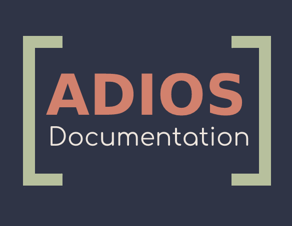

# ADIOS2 First steps



[[Github](https://github.com/ornladios/ADIOS2)] [[Documentation](https://adios2.readthedocs.io/en/latest/)]

**List of projects**
1. Campaign engine 
    * Create engine with multiple BP4 engines underneath
    * `FileEngine` folder

```
git@github.com:anagainaru/ADIOS2.git
git checkout file_engine
```
  
2. Adios serializer on CPU 
    * Reimplement for GPU
3. Data streaming

## Installing ADIOS-2 

Installing ADIOS-2 from source code from the latest github release.

```
export ADIOS_HOME=`pwd`
git clone https://github.com/ornladios/ADIOS2.git
mkdir build
mkdir install
cd build/
```

Both installing on the laptop and the summit instructions will require the `build` and `install` folders.

```
cmake ../ADIOS2
make -j
ctest
cmake -D CMAKE_INSTALL_PREFIX=${ADIOS_HOME}/install ../ADIOS2/
make -j install
```
In order to use ADIOS-2 inside python:
```
export PYTHONPATH=/Users/95j/work/adios/adios2-install/Python/3.8/site-packages
```

Libraries used to link ADIOS-2 with applications can be found in `${ADIOS_HOME}/install/lib64/cmake/adios2/`

## Using ADIOS-2 on Summit
```
module load cmake
module load gcc

cmake -DADIOS2_USE_Fortran=ON -DCMAKE_C_COMPILER=gcc -DCMAKE_CXX_COMPILER=g++ -DCMAKE_Fortran_COMPILER=gfortran ../ADIOS-2
make -j
cmake -D CMAKE_INSTALL_PREFIX=${ADIOS_HOME}/install ../ADIOS2/
make -j install
```
Using the modules available on Summit
```
$ module avail adios

 /autofs/nccs-svm1_sw/summit/modulefiles/site/linux-rhel7-ppc64le/spectrum-mpi/10.3.1.2-20200121-p6nrnt6/xl/16.1.1-5
   adios2/2.4.0    adios2/2.5.0 (D)

$ module load adios2
```

## Running the tests

Run manually the same tests from the CI. From the buid directory, run `ctest`.
```
ctest -I S,E 
# Run tests from number S to number E

ctest -R TestName
# Run only test that contain TestName

ctest ... -VV
# Verbose

```

## Running simple storage example

ADIOS-2 has several examples on how to use each engine in `${ADIOS_HOME}/ADIOS2/examples/` (github link [here](https://github.com/ornladios/ADIOS2/tree/master/examples)).

For storage transfer to and from applications, the BP engine is used.

```
$ cd ${ADIOS_HOME}/build

$ bin/hello_bpWriter
Wrote file myVector_cpp.bp to disk. It can now be read by running ./bin/hello_bpReader.

$ bin/hello_bpReader
Float vector inside myVector_cpp.bp: {0, 1, 2, 3, 4, 5, 6, 7, 8, 9, }
```

## Running simple streaming example

For streaming, the SST or SSC engines can be used. From the `${ADIOS_HOME}/build` directory:

| Terminal 1 | Terminal 2 |
|---|---|
|`$ ./bin/hello_sstWriter` | `$ ./bin/hello_sstReader` |
| | Incoming variable is of size 10 <br/> Reader rank 0 reading 10 floats starting at element 0 |

## Test what data was written to the BP folder

The `pbls` executable can be used to show data contained inside a bp folder. For example, the `hello_bpWriter` exec create a folder called `myVector_cpp.bp`.
```
$ ./bin/bpls -ld myVector_cpp.bp/
  float    bpFloats  {10} = 0 / 9
    (0)    0 1 2 3 4 5
    (6)    6 7 8 9 

  int32_t  bpInts    {10} = -9 / 0
    (0)    0 -1 -2 -3 -4 -5
    (6)    -6 -7 -8 -9 

$ ./bin/bpls -l myVector_cpp.bp/
  float    bpFloats  {10} = 0 / 9
  int32_t  bpInts    {10} = -9 / 0
```
